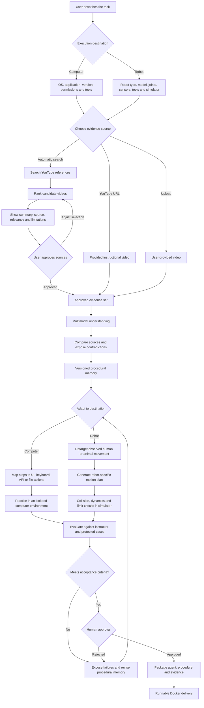

# Product flow

APRENDIZ is a domain-independent procedural-learning system. A task can target execution on a computer or an embodied robot. Video evidence describes the task; a separate execution contract defines how that task can be performed safely on the selected destination.

## Destination contracts

### Computer execution

- Operating system, application, version, resolution, locale, permissions, and available tools.
- Allowed action primitives such as mouse, keyboard, browser automation, APIs, and file operations.
- Isolated practice environment, reversible actions, secret handling, and frozen evaluation cases.

### Robot execution

- Robot category and exact model: arm, mobile base, humanoid, quadruped, or another supported embodiment.
- Kinematic model or URDF, joint map, limits, actuators, sensors, end effectors, workspace, payload, and simulator.
- Motion retargeting from a human or animal reference into robot-feasible trajectories.
- Collision checking, dynamics validation, safety envelopes, simulation evidence, and explicit human approval before any hardware adapter can run.

A human or animal video cannot by itself produce universally safe robot code. It supplies behavioral evidence. The target robot contract and simulator determine whether the behavior can be translated into executable, robot-specific motion.

## Reference discovery rules

- Search results are candidates, not training data, until the user approves them.
- Show source URL, creator/channel, concise summary, relevance, contradictions, limitations, and estimated processing cost.
- Do not automatically download YouTube videos. Pass supported approved URLs to the provider or ask for a user-supplied file.
- Preserve source attribution and evidence lineage inside procedural memory.
- Keep an approved training set separate from frozen evaluation sources.

